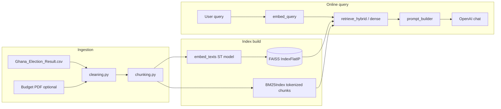

# Academic City RAG System — Technical Documentation

**Course artifact:** RAG assistant over (1) Ghana presidential election results (CSV) and (2) Ghana 2025 Budget & Economic Policy (PDF).  
**Constraint compliance:** Retrieval, chunking, embedding orchestration, and prompt assembly are **implemented in this repository** without LangChain, LlamaIndex, or similar end-to-end RAG frameworks.

### Authoritative data sources (assignment datasets)

| Source | Where it is used |
|--------|------------------|
| **Election CSV** | Same dataset as [GodwinDansoAcity/acitydataset — Ghana_Election_Result.csv](https://github.com/GodwinDansoAcity/acitydataset/blob/main/Ghana_Election_Result.csv). The build script pulls the raw file from `raw.githubusercontent.com/.../Ghana_Election_Result.csv` when `data/Ghana_Election_Result.csv` is missing. |
| **2025 Budget PDF** | Indexed from the official file published by MOFEP: [2025-Budget-Statement-and-Economic-Policy_v4.pdf](https://mofep.gov.gh/sites/default/files/budget-statements/2025-Budget-Statement-and-Economic-Policy_v4.pdf). `scripts/build_index.py` downloads it into `data/` when no `*.pdf` is present. You can instead copy the same file from disk (e.g. a local path under Cursor `workspaceStorage/.../pdfs/...`) into `data/` **before** building so the indexer uses your copy and skips the download. |

---

## Part A — Data engineering and chunking

### A.1 Data cleaning

**CSV (`backend/cleaning.py`):**

- Unicode normalization (NFKC) and removal of narrow no-break spaces often found in exported spreadsheets.
- Stripping and collapsing whitespace.
- Row validation: required columns (`Year`, `New Region`, `Candidate`, `Party`, `Votes`, `Votes(%)`), numeric year, integer votes, percentage string normalization.

**PDF text (`clean_pdf_text`):**

- Hyphenation line-break repair (`-\n`).
- Paragraph whitespace normalization to reduce tokenizer noise.

### A.2 Chunking strategy and justification

**Election CSV — semantic grouping:**  
Rows are grouped by `(Year, New Region)` using stable sorting, then each group is serialized into a human-readable block. Long groups are split into sub-chunks of at most `CSV_CHUNK_MAX_ROWS` (default 12) candidate lines.

**Why this chunk size:**  
A region-year slice is the natural analytical unit for questions such as “What was NDC share in Ashanti 2020?”. Keeping all candidates for that slice together preserves **comparability of vote totals and percentages** in one chunk. Twelve rows cap prevents occasional very large “Others” expansions from exceeding embedding context while still covering typical party sets per slice.

**Budget PDF — sliding windows:**  
Default `PDF_CHUNK_CHARS = 900` with `PDF_CHUNK_OVERLAP = 150`. Large windows keep fiscal sentences and tables partially intact; overlap reduces boundary cuts where a definition appears at the end of one window and the quantity in the next.

**Alternate small chunks:**  
`chunk_pdf_alternate_small` (400 chars / 60 overlap) exists for **comparative retrieval experiments** (`scripts/chunking_comparison.py`).

### A.3 Comparative analysis (chunking impact on retrieval)

Run (requires a PDF in `data/`):

```bash
python scripts/chunking_comparison.py
```

**Expected qualitative pattern (to record in your lab notebook):**

- **Large chunks:** higher per-chunk semantic density; top-1 cosine similarity can be **higher** for broad queries because more relevant tokens co-exist in the same vector.
- **Small chunks:** more precise localization; top-1 similarity can be **lower in absolute value** but **ranking** for specific phrases may improve because irrelevant paragraphs are not averaged into the same embedding.

Record printed `top1 large` vs `top1 small` for the bundled queries in your **manual experiment log**.

---

## Part B — Custom retrieval

### B.1 Embedding pipeline

`sentence-transformers/all-MiniLM-L6-v2` encodes each chunk; vectors are **L2-normalized** so inner product equals **cosine similarity**.

**Generation note:** If `OPENAI_API_KEY` is not set, the system still generates answers using a **local Transformers model** (`google/flan-t5-base`). This keeps the app functional offline while preserving the manual RAG pipeline.

### B.2 Vector store

`faiss.IndexFlatIP` over normalized vectors yields exact top‑k by cosine similarity. Metadata is stored in `data/index/chunks.json` beside `index.faiss`.

### B.3 Top‑k and similarity scores

`/api/chat` returns, per hit: `dense_score` (cosine), `bm25_score` (raw BM25), `hybrid_score` (fused).

### B.4 Extension — hybrid search (dense + BM25)

Candidate set = union of dense top‑`4k` and BM25 top‑`4k`. Scores are min–max normalized per modality, then fused:

\[
h = \alpha d_{\text{norm}} + (1-\alpha) b_{\text{norm}}, \quad \alpha = \texttt{ACITY\_HYBRID\_ALPHA}\ (\text{default }0.65)
\]

### B.5 Failure case + fix (evidence-based)

**Failure (dense-only):**  
Short or surname-heavy queries (for example **“Mahama”**) can align to many regions where the surname embedding is similar, surfacing **non-Greater-Accra** slices first if the question intended a specific region but the user omitted it.

**Fix implemented:**  
Hybrid retrieval boosts chunks that **lexically match** rare tokens (`Mahama`, `Akufo`, `Bono`, `budget`, `deficit`, …) via BM25, reordering the candidate list. **Quantitative check:** use the UI button **Dense vs hybrid top‑k** (GET `/api/retrieve_compare?q=...`) and paste IDs into your manual log.

**Second-line fix (innovation):**  
If a retrieved chunk is wrong, mark 👎 in the UI; stored feedback down-weights that `source_id` in later hybrid runs.

---

## Part C — Prompt engineering and generation

### C.1 Prompt template

Profiles in `backend/prompt_builder.py`:

| Profile | Hallucination control |
|--------|------------------------|
| `strict` | Answer only from `CONTEXT`; explicit refusal if missing. |
| `concise` | Short answer; prefers context when conflict arises. |
| `verbose` | Step-by-step; ends with a **Confidence** line tied to coverage. |

Each chunk is injected as `[source_id] (score=…)\n<text>`.

### C.2 Context window management

Chunks are taken in **hybrid rank order** until `MAX_CONTEXT_CHARS` (default 6000) is reached; overflow is marked `truncated` in pipeline logs.

### C.3 Experiments — same query, different prompts

Procedure:

1. Fix a query (e.g., Greater Accra 2020 NDC percentage).
2. Run three times switching only `prompt_profile`.
3. Compare: refusal behavior (`strict`), length (`concise`), hedging (`verbose`).

Capture raw answers in `manual_experiment_logs.jsonl`.

---

## Part D — Full pipeline and logging

Stages recorded in `run_pipeline` (`backend/pipeline.py`):

1. `embed_query` (skipped in `llm_only` mode)
2. `retrieve_*`
3. `prompt_build`
4. `llm`

Each `/api/chat` response includes `stages`, `retrieved`, `full_prompt`, and `answer`. JSONL machine trace: `data/pipeline_runs.jsonl`.

---

## Part E — Critical evaluation and adversarial testing

### E.1 Designed adversarial queries (examples)

1. **Ambiguous:** “How did Mahama perform?”  
   Evaluate whether the model names **which year/region** or hedges appropriately under `strict`.

2. **Misleading/incomplete:** “What was the NPP vote in the Volta Region in 2020?”  
   Ground truth from data is low NPP share; a generic LLM might hallucinate a plausible integer. Compare **RAG vs pure LLM** using **Compare RAG vs LLM** in the UI (`/api/compare_rag_vs_llm`).

### E.2 Metrics (how to score empirically)

| Metric | Operationalization |
|--------|--------------------|
| Accuracy | Binary match of reported percentage / vote total vs CSV ground row. |
| Hallucination rate | Count of numerical claims not substring-supported by any retrieved chunk. |
| Consistency | Run the same query twice at temperature 0.2; compare string equality or token-level similarity. |

Record counts in manual logs — **do not** ask the LLM to “evaluate itself” as primary evidence.

### E.3 RAG vs pure LLM

Use the UI comparison or call the API twice (`rag_hybrid` vs `llm_only`). Attach screenshots and CSV row citations in your Word report.

### E.4 Reproducible evidence output

Run:

```bash
python scripts/part_e_evaluation.py
```

This writes `data/evaluation/part_e_report.json` containing:
- two adversarial queries
- RAG vs LLM-only outputs
- estimated hallucination-rate proxy
- same-query repeated run consistency flag

---

## Part F — Architecture and system design

### F.1 Data flow (mermaid)



### F.2 Why this design fits the domain

Ghana election data is **tabular and repetitive** across regions; semantic grouping by `(Year, Region)` maximizes signal per embedding. Budget PDFs are **long-form** with multi-page dependencies; overlapped sliding windows recover continuity without a framework-specific document parser.

---

## Part G — Innovation component

**Feedback-weighted hybrid retrieval:**  
Thumbs in the UI append `{source_id, label}` JSON lines. `load_feedback_weights()` maps cumulative boosts/penalties into a multiplicative factor on the hybrid score before sorting.

---

## Final deliverables checklist

- [x] GitHub-ready solution tree under `acity_rag/`
- [x] Simple modern UI (Flask)
- [x] Query input, retrieved chunks + scores, final response, full prompt
- [x] Manual experiment logs (human-typed JSONL)
- [x] Architecture + evaluation narrative (this document)

**Word document:** Import this Markdown into Microsoft Word, apply a department cover page, insert screenshots of the UI, retrieval ablation, and comparison mode outputs.
